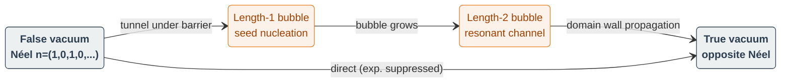
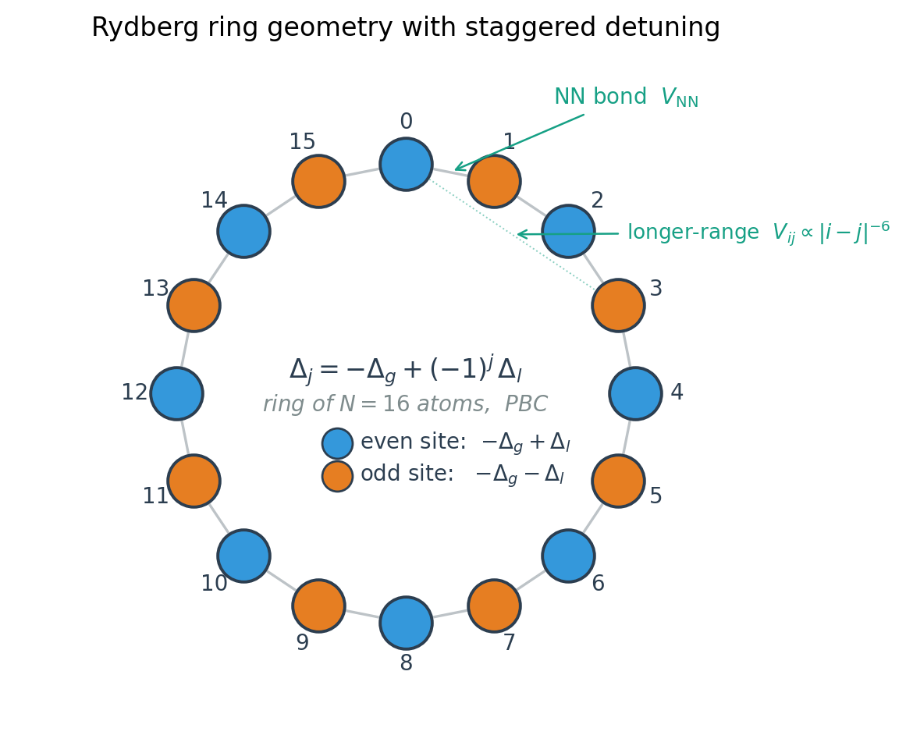
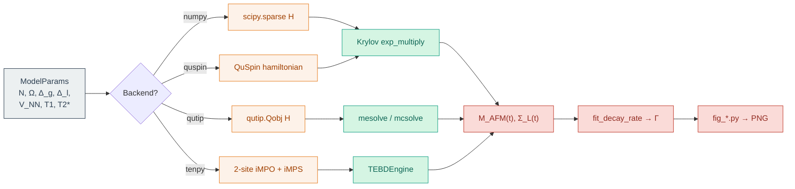

# Rydberg Trampoline

> Resonant bubble nucleation and false-vacuum decay in arbitrary Rydberg atom arrays.

`rydberg_trampoline` is a Python package that reproduces the model and methods of

> Y.-X. Chao, P. Ge, Z.-X. Hua, C. Jia, X. Wang, X. Liang, Z. Yue, R. Lu, M. K. Tey, L. You,
> **Probing False Vacuum Decay and Bubble Nucleation in a Rydberg Atom Array**,
> *Phys. Rev. Lett.* **136**, 120407 (2026); preprint
> [arXiv:2512.04637](https://arxiv.org/abs/2512.04637).

It builds the same staggered-detuning Rydberg ring, time-evolves the Néel
"false vacuum" through three independent solvers (pure NumPy/SciPy, QuTiP,
QuSpin), and adds an iTEBD path for the thermodynamic limit. The hero
figures from the paper are regenerable from runnable scripts and committed
to `docs/figures/`.

---

## Why this is interesting

Coleman's theory of *false-vacuum decay* says that a metastable phase of
the universe can tunnel to a more-stable phase by nucleating a bubble of
true vacuum that then expands at the speed of light. The same equations
govern symmetry-breaking phase transitions in cosmology, condensed
matter, and quantum field theory — but the rates involved are
astronomical, so direct experimental tests are scarce.

Rydberg atom arrays are nearly ideal **analog quantum simulators** of
this physics: the atoms are individually controllable, the interactions
are well-characterised van-der-Waals couplings, and a staggered detuning
turns the alternating-occupation Néel state into a metastable false
vacuum. Chao et al. (2026) used this platform to (a) confirm the
QFT-style suppression law

```math
\Gamma(\Delta_l) \propto \exp\!\bigl(-B/\Delta_l\bigr)
```

over four-plus orders of magnitude, and (b) discover **resonant**
nucleation — discrete-spectrum channels at specific detunings that
exponentially enhance bubble production beyond the continuum prediction.
This package reproduces the closed-system simulation backbone of that
study and packages the analyses for reuse.

For the longer-form physics walkthrough — Coleman bounce, Rydberg
blockade, the resonant-nucleation mechanism — see
[`docs/background.md`](docs/background.md).
For an architecture deep-dive (module map, dispatcher contract, hidden
basis-ordering coupling) see [`docs/architecture.md`](docs/architecture.md).
For per-backend numerical-method details (complexity, accuracy regime,
which test pins what) see [`docs/numerical_methods.md`](docs/numerical_methods.md).

### A picture of what we're computing

The headline observable is a tunneling rate from the metastable Néel
configuration. Bubbles of contiguous flipped sites mediate the decay:


*The false-vacuum Néel (top), a single-site bubble seed (middle), and a length-3 bubble (bottom) with two domain walls highlighted at the boundaries.*

Each backend simulates the staggered-Rydberg Hamiltonian under a
specific computational tradeoff. The Hilbert-space cost grows
exponentially in N for full ED, doubly-exponentially for Lindblad, and
not at all for iTEBD:


*Memory cost in complex doubles versus N. Each backend annotates its hard cap; cross any line and you are out of laptop RAM.*

The vdW interaction is dominated by the nearest neighbour
(by 64×); the iTEBD backend exploits this by truncating to NN-only,
while the ED backends keep configurable longer ranges:


*Pair coupling V<sub>ij</sub> = C₆/|i−j|<sup>6</sup>. Each curve marks a `vdW_cutoff = R` truncation; iTEBD requires R=1, ED defaults to R=8.*

---

## The model

Each atom is treated as an effective two-level system
(`|g⟩`, `|r⟩`) driven on the two-photon transition. The full
many-body Hamiltonian is

```math
\hat H/\hbar
= \frac{\Omega}{2}\sum_{j=1}^{N} \hat\sigma^{x}_{j}
  + \sum_{j=1}^{N}\Bigl[-\Delta_g + (-1)^{j}\Delta_l\Bigr]\hat n_j
  + \sum_{i<j} V_{ij}\,\hat n_i\hat n_j,\qquad V_{ij}\propto \frac{1}{|i-j|^6}.
```

| Symbol | Meaning | Paper value |
|--------|---------|-------------|
| `Ω` | Rabi frequency on the dressed ground–Rydberg transition | 1.8 MHz |
| `Δ_g` | Global detuning | 4.8 MHz |
| `Δ_l` | Staggered detuning (the symmetry-breaking parameter) | 0.4–3.0 MHz scan |
| `V_NN` | Nearest-neighbour van-der-Waals coupling | 6 MHz |
| `T₁ / T₂*` | Atomic relaxation / dephasing | 28 / 3.8 μs |


*Effective two-level system per atom on the dressed ground–Rydberg transition; site-resolved staggered detuning enters via Δ_j = −Δ_g + (−1)^j Δ_l.*

---

## Vacuum mapping

The staggered detuning makes the two Néel configurations
(*even-sites occupied* vs *odd-sites occupied*) energetically inequivalent.
The shallow Néel phase plays the role of a metastable "false vacuum",
the deeper one is the "true vacuum", and small contiguous flipped runs
("bubbles") mediate the transition.



*Tunneling pathway from the false-vacuum Néel through length-1 and length-2 bubble configurations to the opposite-Néel true vacuum. The direct FV → TV arrow is exponentially suppressed and proceeds via the bubble sequence.*

The `M_AFM` order parameter

```math
M_{\mathrm{AFM}} = \frac{1}{N}\sum_{j} (-1)^{j}\,\langle\hat\sigma^z_j\rangle
```

equals `+1` on the false vacuum, `-1` on the true vacuum, and decays
through `0` (mixed) as the system tunnels.

---

## Lattice and computation diagrams

A 16-site ring with the staggered detuning highlighted by alternate
colours; the package's `Geometry.RING` corresponds exactly to this
periodic-boundary geometry:



*16-site Rydberg ring with periodic boundary conditions. Even (blue) sites carry detuning $-\Delta_g + \Delta_l$, odd (orange) sites carry $-\Delta_g - \Delta_l$. NN bonds are the polygon edges; the dotted segment shows a representative longer-range $V_{ij}\propto |i-j|^{-6}$ coupling.*

End-to-end pipeline from `ModelParams` through backend-specific solvers
to a hero figure (Krylov = `scipy.sparse.linalg.expm_multiply`;
mesolve/mcsolve = QuTiP density-matrix RK45 and trajectory Monte-Carlo
respectively):



*Each backend emits its native Hamiltonian object, hands it to a backend-appropriate solver, and converges on the shared `M_AFM` / `Σ_L` observable evaluator before fitting Γ.*

---

## Picking a backend

| Backend | Best for | Cap on N |
|---|---|---|
| `numpy` | default closed-system ED; small Lindblad | 18 / 10 |
| `qutip` | open-system Lindblad with experimental T₁, T₂* | 18 (mcsolve) |
| `quspin` | larger N via translation-by-2 sectors | 22 with `kblock` |
| `tenpy` | thermodynamic-limit `M_AFM(t)`, NN-only vdW | ∞ |
| `bloqade` | analog Rydberg emulator, or QuEra Aquila | 256 (Aquila) |

See [`docs/numerical_methods.md`](docs/numerical_methods.md#method-vs-regime-decision-tree)
for the full method-vs-regime decision tree.

---

## Hero figures

Each panel is regenerated by a runnable Python module under
`rydberg_trampoline/figures/`. PNGs in `docs/figures/` were rendered with
the parameters in the corresponding `.json` sidecars.

### M_AFM(t) decay traces (paper Fig. 2)


*Lindblad evolution of `M_AFM^res(t)` at four `Δ_l`. The non-monotone ordering of the curves is the signature of the underlying resonance structure.*

Rescaled antiferromagnetic order under Lindblad evolution with the
experimental T₁ and T₂* decoherence times. Larger `Δ_l` makes the
metastable Néel decay faster, but the rate is not monotone in `Δ_l`
because of the underlying resonance structure.

### Γ vs 1/Δ_l (paper Fig. 3)


*Unitary Γ vs 1/Δ_l with the global thin-wall fit. Departures from the line are the discrete-spectrum bubble channels.*

Closed-system unitary decay rate from the same false-vacuum Néel,
plotted against `1/Δ_l` on a log-y scale. The red line is a global
`Γ = A · exp(−B/Δ_l)` fit; deviations (humps and dips) above the line
signal discrete-spectrum bubble channels.

### Resonance scan (paper Fig. 3 inset / Fig. 4)


*Linear-scale Γ(Δ_l) above; time-averaged bubble density below. The two panels track each other peak-for-peak — direct evidence of resonant nucleation.*

Linear-scale `Γ(Δ_l)` and time-averaged total bubble density. The
deviations from the smooth tunneling law track the time-averaged bubble
content, supporting the resonant-nucleation interpretation.

### Bubble-length distribution (paper Fig. 4)


*⟨Σ_L⟩ at an off-resonance Δ_l (smooth law) versus an on-resonance Δ_l (larger-L bubbles amplified).*

Time-averaged `⟨Σ_L⟩` for `L = 1, 2, 3` at an "off-resonance" `Δ_l`
where the smooth law dominates and an "on-resonance" `Δ_l` where larger
bubbles are amplified.

### Imperfection sensitivity (paper Fig. 5 / SM)


*Decay shape under `single_flip_admixed_neel` initial-state imperfection. Lower fidelity decays faster — preparation noise seeds the resonant channels.*

Replacing the perfect Néel by a slightly perturbed initial state shifts
the trajectory. The default noise model is a coherent admixture of
single-flip states (`single_flip_admixed_neel`), which mimics finite
Rabi-pulse preparation infidelity; lower fidelity decays faster, exactly
the qualitative effect the paper highlights. A Haar-random admixture is
available via `--noise-model haar`.

### Finite-N ED vs iTEBD (this package)


*N=8 ED, N=12 ED, and iTEBD (N→∞) at NN-only vdW. The three curves coincide until the N=8 light cone reaches the ring boundary near t ≈ 2.7 μs; from there the N=8 trace decouples while the N=12 and iTEBD curves keep tracking each other.*

Closed-system M_AFM(t) at the same Δ_l for N=8 ED, N=12 ED, and iTEBD
(N → ∞) with NN-only vdW. The three curves overlap at short times and
the finite-N=8 trace separates from N=12 and iTEBD around t ≈ 2.7 μs as
the boundary makes itself felt. Useful both as a backend showcase and
as a figure-level cross-check for the iTEBD ↔ ED short-time agreement.

---

## Installation

```bash
# Base install — pure NumPy/SciPy backend, all figures except Lindblad.
pip install -e .

# Add backends as you need them:
pip install -e .[qutip]     # closed/open-system via QuTiP (recommended)
pip install -e .[quspin]    # symmetry-resolved ED via QuSpin
pip install -e .[itebd]     # infinite-chain iTEBD via TeNPy
pip install -e .[all]       # everything
pip install -e .[dev]       # plus pytest etc.
```

Python 3.11 or 3.12 are supported. QuSpin and TeNPy require a working
C++/Cython toolchain.

---

## Quickstart

```python
import numpy as np
from rydberg_trampoline import ModelParams, run_unitary

params = ModelParams(N=8, Omega=1.8, Delta_g=4.8, Delta_l=2.0, V_NN=6.0)
times = np.linspace(0.0, 2.0, 41)
res = run_unitary(params, times)         # default backend: numpy
print(res.m_afm[:5])                      # M_AFM(t) at the first five timesteps
```

Open-system evolution with the experimental decoherence:

```python
from rydberg_trampoline import run_lindblad

params = params.with_(T1=28.0, T2_star=3.8)
res = run_lindblad(params, times, backend="qutip", method="auto")
```

Switch backends transparently:

```python
res_numpy  = run_unitary(params.with_(T1=None, T2_star=None), times, backend="numpy")
res_qutip  = run_unitary(params.with_(T1=None, T2_star=None), times, backend="qutip")
res_quspin = run_unitary(params.with_(T1=None, T2_star=None), times, backend="quspin")
```

iTEBD on the infinite chain (`vdW_cutoff` truncated to NN — see the
backend docstring):

```python
from rydberg_trampoline import run_itebd
res = run_itebd(params.with_(T1=None, T2_star=None, vdW_cutoff=1), times, chi=80)
```

---

## Backend reference

| Backend | Methods | Hard cap on N | Extra dependency |
|---------|---------|---------------|-------------------|
| `numpy` | `expm_multiply` Krylov ED, dense Liouvillian Lindblad | 18 / 10 | none |
| `qutip` | `sesolve`, `mesolve` (≤ 10), `mcsolve` (> 10) | 18 (mcsolve) | `qutip>=5.0` |
| `quspin`| Krylov ED on full Hilbert space *or* a `kblock` / `pblock` symmetry sector | 22 with `kblock` | `quspin>=0.3.7` |
| `tenpy` | TEBD on a 2-site iMPS (NN-only vdW) | thermodynamic limit | `physics-tenpy>=0.11` |
| `bloqade` | Analog Rydberg via in-process emulator *or* QuEra Aquila on AWS Braket (paid, opt-in) — shot-statistical, M_AFM only, starts from \|gg…g⟩ | 256 (Aquila) | `bloqade>=0.30`, `amazon-braket-sdk` |

The QuSpin sector path:

```python
res = run_unitary(params, times, backend="quspin", kblock=0)
# The Néel false-vacuum lives in (kblock=0, pblock=+1). Larger N benefits
# most: at N=16 the k=0 sector is ≈ 4× smaller than the full Hilbert space.
```

The bloqade cloud-and-emulator path:

```python
# In-process emulator (free, no AWS):
res = run_unitary(params, times, backend="bloqade", n_shots=2000, seed=0)

# Async variant for notebooks / larger pipelines:
from rydberg_trampoline import run_unitary_async
res = await run_unitary_async(params, times, n_shots=2000)
```

Real-cloud submission to QuEra Aquila and AWS auth setup are documented
in [`docs/cloud_quickstart.md`](docs/cloud_quickstart.md). Submission is
gated behind an explicit `i_understand_this_costs_money=True` flag so
nothing is billed by accident.

Cross-backend regression on N = 8 confirms the closed-system
M_AFM(t) trajectories agree to ~10⁻⁶ (QuTiP RK tolerance) or 10⁻¹⁴
(NumPy ↔ QuSpin Krylov).

---

## Reproducing the paper

```bash
# Rebuild every PNG in docs/figures/
scripts/regenerate_figures.sh

# Or one at a time, with full per-figure flags:
python -m rydberg_trampoline.figures.fig_gamma_vs_inv_delta --N 12

# CLI shortcuts:
python -m rydberg_trampoline.cli backends            # list installed backends
python -m rydberg_trampoline.cli figures all         # rerun every figure
```

Experimental data overlay (digitised from paper figures via WebPlotDigitizer):
see [`rydberg_trampoline/data/experimental/PROVENANCE.md`](rydberg_trampoline/data/experimental/PROVENANCE.md).
Until digitisation is in, the figure scripts simply omit the overlay.

---

## Status and known limitations

- iTEBD long-range support beyond nearest-neighbour was prototyped via
  TeNPy's `ExpMPOEvolution` (W^II MPO) and found to be numerically
  unstable for our parameters in TeNPy 1.1; it is disabled until a TDVP
  iMPS path is wired up.
- The QuSpin backend supports **translation-by-2 momentum sectors** at
  the dynamics level: pass `kblock=k` to `run_unitary` and the initial
  state is projected into the sector basis before evolution. Bond
  inversion (`pblock`) is exposed but emits a `GeneralBasisWarning`
  because it does not strictly commute with translation-by-2 — use one
  or the other, not both, in production.
- The imperfection figure now defaults to a coherent **single-flip
  admixture** (`single_flip_admixed_neel`) which models the dominant
  preparation infidelity from a finite Rabi pulse; the Haar-random model
  remains available via `--noise-model haar`.
- Experimental data overlay infrastructure is wired into the figure
  scripts but the digitised CSVs are not yet shipped (see
  [`PROVENANCE.md`](rydberg_trampoline/data/experimental/PROVENANCE.md)).
  Overlays no-op gracefully when CSVs are absent.

## Reproducible Docker image

```bash
docker build -t rydberg-trampoline:dev .
docker run --rm -it -v "$PWD":/work -w /work rydberg-trampoline:dev pytest -q
```

Avoids the QuSpin / TeNPy install dance on contributor machines.

---

## Further reading inside this repo

- [`docs/background.md`](docs/background.md) — long-form physics
  background, from Coleman's bounce to discrete-spectrum resonance.
- [`docs/architecture.md`](docs/architecture.md) — module map,
  dispatcher contract, basis-ordering reconciliation per backend.
- [`docs/numerical_methods.md`](docs/numerical_methods.md) — what each
  backend's solver actually does, with complexity and accuracy tables.
- [`docs/cloud_quickstart.md`](docs/cloud_quickstart.md) — running on
  QuEra Aquila via AWS Braket.
- [`CLAUDE.md`](CLAUDE.md) — same architecture summary in the format
  consumed by Claude Code agents.

## References

- Chao et al., *Probing False Vacuum Decay and Bubble Nucleation in a
  Rydberg Atom Array*, PRL **136**, 120407 (2026) —
  [arXiv:2512.04637](https://arxiv.org/abs/2512.04637).
- S. Coleman, *Fate of the False Vacuum*, Phys. Rev. D **15**, 2929 (1977).
- Bernien et al., *Probing many-body dynamics on a 51-atom quantum simulator*,
  Nature **551**, 579 (2017).

## License

MIT.
