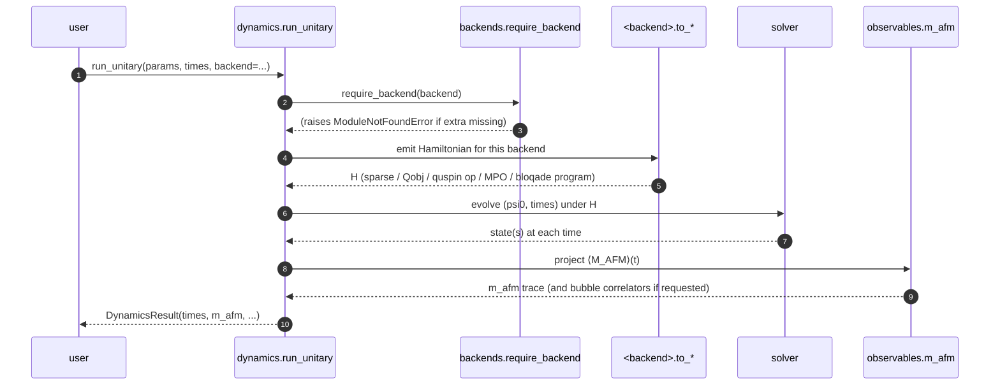
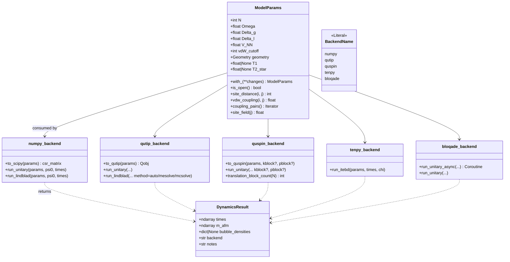

# Architecture

This document is the technical companion to [`README.md`](../README.md).
It describes how the package is organised, what each module is
responsible for, the contract between the dispatcher and individual
backends, and the small set of conventions that every backend must agree
on. If you only want to *use* the package, the README is enough; this
document is for contributors who want to *change* it.

## Module map

```
rydberg_trampoline/
├── conventions.py          single source of truth for n vs σ^z, site
│                           order, ring vs chain
├── model.py                ModelParams (frozen dataclass) — the only
│                           physics specification consumed by every
│                           backend
├── states.py               product-state factories: Néel,
│                           perturbed-Néel, single-flip-admixed,
│                           equal-superposition
├── observables.py          M_AFM and Σ_L diagonals (real arrays of
│                           length 2^N, evaluated as a single dot
│                           product on a state vector or density-
│                           matrix diagonal)
├── dynamics.py             top-level dispatcher: run_unitary,
│                           run_unitary_async, run_lindblad, run_itebd
│                           and the DynamicsResult dataclass
├── analysis.py             curve fits: fit_decay_rate (Γ from a
│                           single trace) and fit_tunneling_action
│                           (B from Γ vs 1/Δ_l)
├── backends/
│   ├── __init__.py         BackendName Literal + available_backends()
│   │                       discovery helper + require_backend() guard
│   ├── numpy_backend.py    scipy.sparse + expm_multiply + dense
│   │                       Liouvillian Lindblad
│   ├── qutip_backend.py    sesolve / mesolve / mcsolve (auto-switch
│   │                       at N=10)
│   ├── quspin_backend.py   full-Hilbert and translation-by-2 sector-
│   │                       resolved Krylov
│   ├── tenpy_backend.py    TEBD on a 2-site iMPS (NN-only vdW)
│   └── bloqade_backend.py  in-process emulator and QuEra Aquila on
│                           AWS Braket (cost-gated)
├── figures/
│   ├── _common.py          common argparse + sidecar-writer helpers
│   └── fig_*.py            one runnable script per hero figure
├── data/
│   ├── loader.py           CSV loader for digitised paper data
│   └── experimental/       digitised CSVs + provenance YAML sidecars
└── cli.py                  thin argparse wrapper for figures
```

## The `run_unitary` call flow



The bloqade path is the only one that is shot-statistical: each timepoint is
its own program submitted to the emulator (or to QuEra Aquila), and the
"state(s) at each time" arrow above is replaced by a `(n_shots, N)` array
of bitstrings that gets fed to `_m_afm_from_bitstrings` rather than to the
diagonal-observable evaluator.

## Type and data-class structure



`ModelParams` is the *only* physics specification — all five backends
consume it unchanged. `DynamicsResult` is the lowest common denominator
return type: every entry point produces one. The `BackendName` literal
is deliberately tight; adding a backend means editing it in one place
and registering its detector in `backends/__init__.py::available_backends`.

## Hidden coupling: conventions

Every backend has its own basis-ordering convention. To keep the rest of
the package free of this complexity we reconcile each backend's
convention to the project's at the *boundary* of that backend, and the
project convention is the single source of truth:

* **Occupation vs spin.** Internally we use `n_j ∈ {0, 1}`; the conversion
  to `σ^z = 2n − 1 ∈ {±1}` only happens at emit time. `ground` is `n=0`,
  `Rydberg` is `n=1`.
* **Site ↔ bit ordering.** Site 0 is the *least*-significant bit of the
  integer that indexes the computational basis state. `|b_{N-1} … b_1
  b_0⟩` has integer index `Σ_j b_j · 2^j`.
* **Geometry.** A ring (PBC) is the physics; an open chain is supported
  only for testing.
* **Néel phase.** `phase=0` is the false vacuum: even sites occupied,
  `n = (1, 0, 1, 0, …)`. `phase=1` is the true vacuum: odd sites
  occupied.

The reconciliations live in:

| Backend | Where | What it reconciles |
|---|---|---|
| `numpy` | `_kron_op_at` and `_diag_n_at` (numpy_backend.py) | Builds `tensor(I, …, op_j, …, I)` with `op_j` in the *last* slot, so the integer index has site 0 = LSB. |
| `qutip` | `_site_op` (qutip_backend.py) | Reverses QuTiP's left-to-right tensor order with `factors[N-1-j] = op` so QuTiP's leftmost factor is site `N-1`. |
| `quspin` | `_project_to_quspin_perm` (quspin_backend.py) | Composes a bit-reverse (QuSpin uses MSB-first site encoding) with a `basis.states` reorder (QuSpin sorts integers descending in the basis). |
| `tenpy` | `_initial_neel_imps` (tenpy_backend.py) | A 2-site iMPS with `up`/`down` strings; SpinHalfSite's `Sz` returns `σ^z / 2`, so M_AFM = `S^z_0 − S^z_1`. |
| `bloqade` | `_m_afm_from_bitstrings` (bloqade_backend.py) | Aquila's measurement basis is exactly `n ∈ {0, 1}` with site 0 leftmost in the bitstring — matches the project convention directly. |

Touching `conventions.py`, the M_AFM diagonal, or the basis-ordering
helpers above is a cross-cutting change: the cross-backend regression
test (`tests/test_cross_backend.py`) is what proves you got it right.

## Physics on the bloqade backend

The bloqade backend has two additional contracts that the others don't:

1. **Initial state is forced to `|gg…g⟩`.** Aquila prepares atoms in the
   ground state and cannot instantaneously load an arbitrary product
   state. `_ensure_bloqade_ground_state` raises `ValueError` if the
   caller passes any other `psi0`. To compare the bloqade trace against
   another backend, set `psi0 = computational_basis_vector(N, 0)` on the
   reference backend.
2. **Observables are shot-statistical.** `M_AFM(t)` is the mean of `n_shots`
   per-shot AFM values, with `1/√n_shots` shot noise. The
   `bloqade-emulator vs numpy` regression test
   (`tests/test_bloqade_backend.py`) sets `n_shots=4000` so the noise
   floor is well below its tolerance.

The cost gate (`_check_cost_gate`) fires *before* any program is built:
without `i_understand_this_costs_money=True`, `device='cloud'` raises
immediately; with the flag but missing AWS credentials, the auth probe
raises before incurring any charge.

## Where to add a new backend

To add a backend `foo`:

1. **`backends/foo_backend.py`** — implement `run_unitary(params, psi0,
   times, **opts) -> DynamicsResult` (and `run_lindblad` / `run_itebd` if
   relevant). Reconcile basis ordering at this boundary.
2. **`backends/__init__.py`** — extend `BackendName`, add a lazy import
   probe to `available_backends()`, and add an entry to
   `_EXTRA_FOR_BACKEND` so `require_backend` can suggest the right
   `pip install` extra.
3. **`dynamics.py`** — add a `if backend == "foo":` branch in
   `run_unitary` (or other dispatcher functions) that delegates to
   `backends.foo_backend.run_unitary`.
4. **`pyproject.toml`** — add a `[project.optional-dependencies] foo =
   ["foo-sdk>=…"]` extra and pull it into `all`.
5. **`tests/test_cross_backend.py`** — add `foo_required` skip marker
   import and a regression test that pins agreement with the NumPy
   reference at small N.
6. **`README.md`** + **`docs/architecture.md`** — extend the backend
   reference table; document any extra contract (e.g. shot noise,
   sector-only states, async only).

The cross-backend regression test is the gate. If the new backend
doesn't agree with NumPy on N=8 closed-system M_AFM(t) to within its
documented tolerance, something is wrong.

## See also

* [`docs/numerical_methods.md`](numerical_methods.md) — what each
  backend's solver is actually doing under the hood.
* [`docs/background.md`](background.md) — the physics this package
  computes.
* [`docs/cloud_quickstart.md`](cloud_quickstart.md) — running the
  bloqade backend on QuEra Aquila.
* [`CLAUDE.md`](../CLAUDE.md) — the same architecture summary in the
  format consumed by Claude Code agents.
