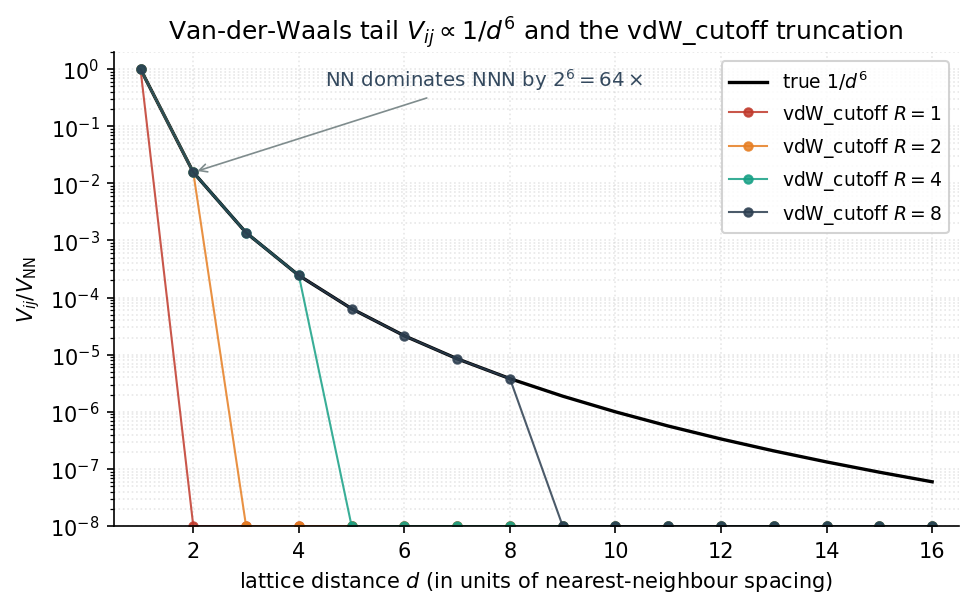
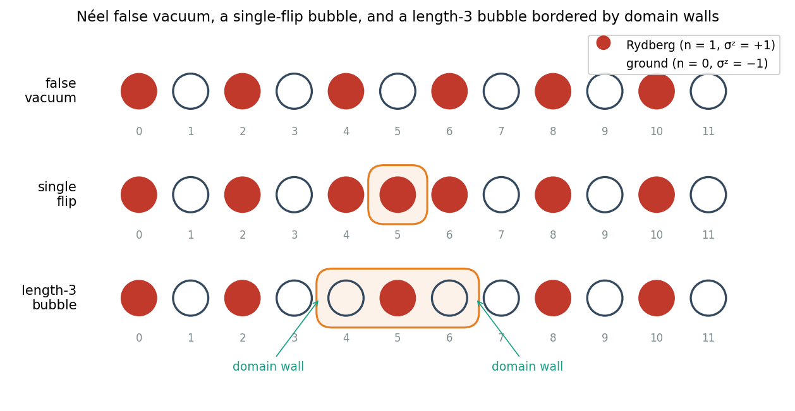

# Physics background

This page expands the README's tagline into a self-contained tour of
the physics implemented by `rydberg_trampoline`. It is aimed at a
reader who knows undergraduate quantum mechanics and a bit of QFT.

## Concept map

```mermaid
flowchart LR
    classDef phys fill:#ecf0f1,stroke:#2c3e50,color:#2c3e50;
    classDef ham fill:#fdf2e9,stroke:#e67e22,color:#a04000;
    classDef obs fill:#d5f5e3,stroke:#16a085,color:#0e6655;
    classDef fig fill:#fadbd8,stroke:#c0392b,color:#922b21;

    fv[false vacuum]:::phys --> neel[Néel n=(1,0,1,0,...)]:::phys
    tv[true vacuum]:::phys --> neel2[opposite Néel]:::phys
    bub[bubble]:::phys --> domain[contiguous flipped run + 2 walls]:::phys
    coleman[Coleman bounce]:::phys --> action[tunneling action B]:::phys

    neel --> H1[Δ_l n_j stagger]:::ham
    domain --> H2[V_ij n_i n_j vdW]:::ham
    blockade[Rydberg blockade]:::phys --> H2
    drive[two-photon Rabi drive]:::phys --> H3[Ω σ^x]:::ham

    H1 --> M[M_AFM order parameter]:::obs
    H2 --> SL[Σ_L bubble correlators]:::obs
    H3 --> M

    M --> F1[fig_decay_traces]:::fig
    M --> F2[fig_gamma_vs_inv_delta]:::fig
    M --> F5[fig_imperfection_sensitivity]:::fig
    SL --> F4[fig_bubble_histogram]:::fig
    M --> F3[fig_resonance_scan]:::fig
    SL --> F3
    action --> F2
```

*Concept map: physics objects (blue) → Hamiltonian terms (orange) → observables (green) → hero figures (red). Tracing any figure backward to its physical ingredient is one hop per arrow.*

## 1. False vacua and Coleman bounces

Many quantum field theories have multiple local minima of their
effective potential. A field configuration sitting at a *higher*
local minimum is metastable — classically it is stable, but quantum
fluctuations let it tunnel to a deeper minimum. Sidney Coleman's 1977
paper [*Fate of the False Vacuum*][coleman77] showed that the
tunneling proceeds by nucleating a localized "bubble" of the true
vacuum inside the false-vacuum sea. Once the bubble is large enough to
overcome surface tension, it grows at the speed of light and converts
the surrounding region.

The decay rate per unit volume scales as

```math
\Gamma / V = A \, e^{-S_E},
```

where `S_E` is the Euclidean action of the *bounce* — the
classical solution that interpolates between the false vacuum and the
critical bubble. For a thin-wall bubble in the limit of a small
energy splitting `ε` between the two minima,

```math
S_E \approx \frac{27\pi^2}{2}\,\frac{\sigma^4}{\varepsilon^3},
```

where `σ` is the surface tension of the bubble wall. The strong
suppression for small `ε` is the universal feature: tunneling rates
become exponentially small when the false vacuum is only slightly
metastable.

This same physics governs cosmological phase transitions (electroweak,
GUT scales), stability of the Standard Model (the
[Higgs-vacuum metastability question][higgs-decay]), and many
condensed-matter symmetry-breaking transitions. It is generally
inaccessible to direct experiment because the relevant rates are
too small or the systems too violent.

The dictionary between cosmological / QFT objects and the Rydberg
analogue this package implements:

| Cosmology / QFT | Rydberg analog (this paper / package) |
|---|---|
| Scalar field `φ` at false-vacuum minimum | Néel state with even sites occupied |
| True-vacuum minimum | Opposite-phase Néel (odd sites occupied) |
| Energy splitting `ε` between minima | Staggered detuning `Δ_l` |
| Surface tension `σ` of bubble wall | Domain-wall energy from `V_NN` |
| Critical bubble radius `R*` (Coleman) | Length of the resonance-amplified bubble |
| Bounce action `S_E` (`Γ ∝ exp(−S_E)`) | Tunneling action `B` (`Γ ∝ exp(−B / Δ_l)`) |

The correspondence is exact at the level of the effective long-wavelength
field theory; the Rydberg system additionally carries discrete-spectrum
structure that the continuum field theory misses, which is the source
of the resonant-nucleation effect described in §5.

## 2. Rydberg arrays as analog simulators

A Rydberg atom is an alkali atom (typically ⁸⁷Rb) excited to a
high-`n` Rydberg state — say `|r⟩ ≡ |70 S₁/₂⟩` — which has long
lifetime and very large dipole moment. Two Rydberg atoms separated by
a few μm experience a strong van-der-Waals interaction `V_ij = C₆ /
r⁶` that scales as the 11th power of the principal quantum number,
giving MHz-scale couplings at typical lattice spacings.

Treating each atom as an effective two-level system `{|g⟩, |r⟩}`,
driven on a two-photon transition with effective Rabi frequency `Ω`
and detuning `Δ`, the array Hamiltonian on a 1D chain or ring is

```math
\hat H/\hbar
= \frac{\Omega}{2}\sum_{j} \hat\sigma^{x}_{j}
  + \sum_{j}\Delta_j\,\hat n_j
  + \sum_{i<j} V_{ij}\,\hat n_i\hat n_j,
```

with site-resolved detunings `Δ_j` set by spatial light modulators.
The Rydberg-blockade regime (large `V` for nearest neighbours) means
no two adjacent atoms can both be in `|r⟩`, locking the spectrum into
a tiny "PXP" subspace of dimensions much less than `2^N`.

Bernien et al. demonstrated [a 51-atom programmable simulator][bernien17]
exhibiting non-thermal "scar" states. Subsequent groups have used
these arrays for spin liquids, lattice gauge theories, and now —
Chao et al. (2026) — quantitative simulation of false-vacuum decay.

## 3. The staggered-detuning model

`rydberg_trampoline` implements the specific Hamiltonian of Chao et
al.: 1D ring with a staggered detuning,

```math
\Delta_j = -\Delta_g + (-1)^{j}\Delta_l.
```

* The *global* detuning `Δ_g` together with the blockade `V` selects
  Néel order as the low-energy classical configuration.
* The *staggered* detuning `Δ_l` lifts the degeneracy between the two
  Néel phases, energetically favouring the phase with even sites
  occupied (n_{2k}=1, n_{2k+1}=0). This is the *true vacuum*; the
  opposite phase is the *false vacuum*.
* The Rabi drive `Ω` couples Néel to nearby states with one or more
  flipped sites — the *bubbles* of true vacuum nucleating inside the
  false vacuum.
* The vdW tail `1/r^6` is dominated by the nearest-neighbour
  contribution (NNN smaller by 64) and provides the effective
  repulsion that makes the bubbles cohesive.

  

  *Two-body coupling V<sub>ij</sub> = C₆/|i−j|<sup>6</sup> with the four `vdW_cutoff` thresholds. iTEBD must use R=1 (TEBD locality); ED defaults to R=8.*

  Each coloured curve shows where the package's `vdW_cutoff = R`
  argument truncates the tail. The TeNPy iTEBD backend uses `R = 1`
  (the steepest red curve) because TEBD requires nearest-neighbour
  bonds; the ED backends default to `R = 8`, which captures essentially
  all of the tail energy.

The order parameter `M_AFM = (1/N) Σ_j (-1)^j σ^z_j` equals `+1` on
the false vacuum, `-1` on the true vacuum, and the rescaled

```math
M^{\mathrm{res}}(t) = \frac{M_{\mathrm{AFM}}(t) + M_{\mathrm{AFM}}(0)}{2 M_{\mathrm{AFM}}(0)}
```

decays from `1` toward `1/2` (maximally mixed Néel content).

## 4. The QFT-style suppression law

When the staggered field is small compared to the bubble wall
energetics, the system is in the analog of the Coleman thin-wall
regime, and dimensional analysis (or careful instanton calculation)
gives the suppression

```math
\Gamma(\Delta_l) \propto \exp(-B/\Delta_l),
```

where `B` is a model-dependent constant that plays the role of the
Euclidean action. The paper verifies this law over four-plus orders
of magnitude in `Γ` by sweeping `Δ_l` from ~0.4 MHz to ~3 MHz and
fitting the early-time slope of `M^res(t)`.

The fit is a one-parameter family in `1/Δ_l`, so plotting
`log Γ` versus `1/Δ_l` should give a straight line. Deviations from
the straight line are the interesting part — they signal physics
beyond the smooth tunneling channel.

## 5. The new physics: resonant nucleation

Chao et al.'s key contribution is the observation that, in a discrete
quantum many-body system, the false-vacuum *spectrum* matters in a way
that the QFT continuum does not capture. As `Δ_l` is varied, the
energy of the metastable Néel state passes through alignments with
specific bubble eigenstates. At those alignments, the matrix element
that connects "false vacuum" to "false vacuum + one bubble of length
L" gets resonantly enhanced, and `Γ` exceeds the smooth law by orders
of magnitude.

What the bubble looks like, concretely:



*The Σ_L bubble-density operator counts contiguous L-flipped runs bordered by FV sites; the highlighted boundaries are the domain walls.*

Top row: the metastable false-vacuum Néel. Middle row: a single-flip
"bubble" — one site has flipped to its true-vacuum value, bordered on
both sides by false-vacuum sites. Bottom row: a length-3 bubble; the
three flipped sites are an extended bubble interior, and the orange
boundaries are the *domain walls* (kinks where neighbours disagree).
The package's `Σ_L` bubble-density operator counts exactly these
length-`L` runs of TV-on-FV with FV-bordering on both ends.

Operationally this shows up as:

* humps in the `Γ vs 1/Δ_l` curve at specific detunings;
* peaks in the time-averaged length-`L` bubble densities `⟨Σ_L⟩`;
* a sensitivity of the decay shape to small imperfections in the
  initial-state preparation, because imperfections seed the resonant
  channels.

This is genuinely a *discrete-spectrum* effect, absent from the
continuum field theory, and reproducible only with a faithful many-body
simulator like a Rydberg array.

## 6. What this code computes

`rydberg_trampoline` exposes three computational modes:

| Mode | Backend(s) | What it gives you |
|---|---|---|
| Closed-system unitary | `numpy`, `qutip`, `quspin` | `M_AFM(t)` and `Σ_L(t)` for arbitrary product-state initial conditions |
| Open-system Lindblad | `qutip` (`mesolve`/`mcsolve`), `numpy` | Same observables under the experimental `T₁`, `T₂*` decoherence |
| Infinite chain | `tenpy` iTEBD | Thermodynamic-limit `M_AFM(t)` with NN-only vdW |

Each backend emits the *same* Hamiltonian (modulo basis-ordering
conventions resolved at the boundary) and the same observable
diagonals, which is what makes the cross-backend regression test
meaningful.

## References

* S. Coleman, *Fate of the False Vacuum*, Phys. Rev. D **15**, 2929 (1977). <https://doi.org/10.1103/PhysRevD.15.2929>
* G. Degrassi et al., *Higgs mass and vacuum stability in the Standard Model at NNLO*, JHEP **08**, 098 (2012). <https://doi.org/10.1007/JHEP08(2012)098>
* H. Bernien et al., *Probing many-body dynamics on a 51-atom quantum simulator*, Nature **551**, 579 (2017). <https://doi.org/10.1038/nature24622>
* Chao et al., *Probing False Vacuum Decay and Bubble Nucleation in a Rydberg Atom Array*, PRL **136**, 120407 (2026) — [arXiv:2512.04637](https://arxiv.org/abs/2512.04637).

[coleman77]: https://doi.org/10.1103/PhysRevD.15.2929
[higgs-decay]: https://doi.org/10.1007/JHEP08(2012)098
[bernien17]: https://doi.org/10.1038/nature24622
