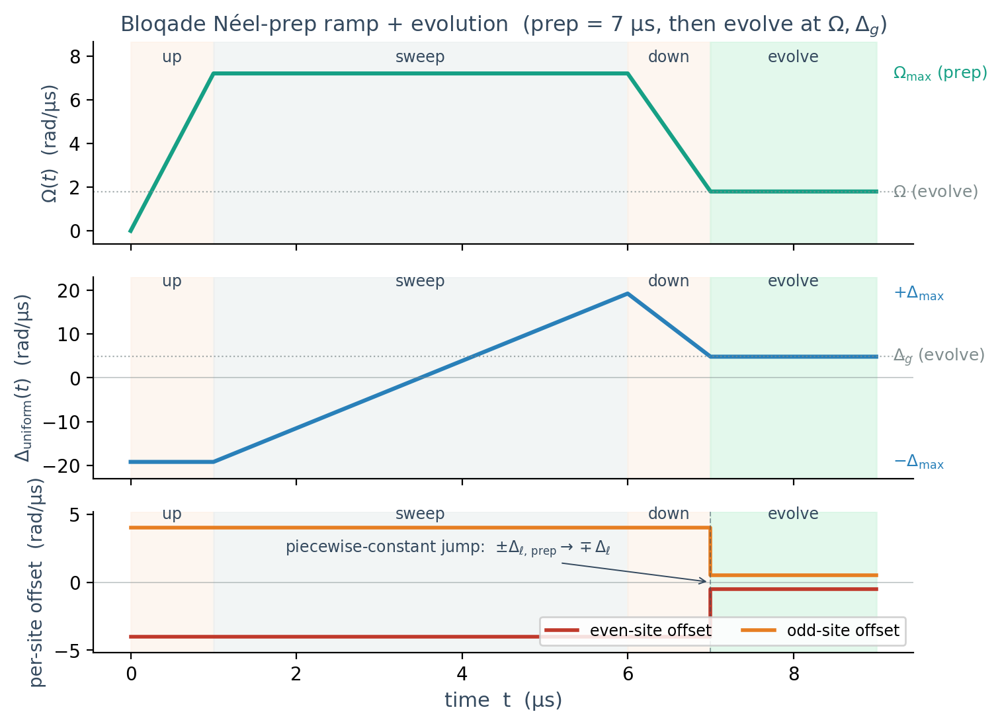

# Cloud quickstart — QuEra Aquila via bloqade

`rydberg_trampoline` includes a `bloqade` backend that submits the
staggered Rydberg Hamiltonian to either an in-process local emulator
(default, free, no network) or to QuEra Aquila on AWS Braket (paid,
opt-in). The same package convention is used on both paths — no
Trotterization, no Hamiltonian rewrite.

## Install

```bash
pip install -e .[cloud,dev]
```

This pulls in `bloqade`, `amazon-braket-sdk`, and `boto3`. Bloqade ships
its own local emulator; you do not need AWS credentials for the
emulator path.

## Local emulator (no AWS needed)

```python
import numpy as np
from rydberg_trampoline import ModelParams, run_unitary

params = ModelParams(N=8, Omega=1.8, Delta_g=4.8, Delta_l=0.5, V_NN=6.0)
times = np.linspace(0.0, 0.5, 11)

res = run_unitary(
    params, times, backend="bloqade",
    n_shots=2000, seed=0,
)
print(res.m_afm)         # ⟨M_AFM⟩(t) from 2000 shots per timepoint
print(res.backend)        # 'bloqade-emulator'
```

The emulator integrates the Schrödinger equation classically and samples
the final state in the Z (occupation) basis at the end of each program.
M_AFM(t) is computed empirically from the bitstrings; the shot-noise
floor is ~1/√n_shots.

## Initial state restriction

Aquila and the emulator both start atoms in the all-ground state
``|gg…g⟩``. The default ``psi0_protocol='ground'`` requires ``psi0`` to be
``None`` or the explicit ``|gg…g⟩`` basis vector — for true apples-to-
apples cross-backend comparisons set the same all-ground initial state
on the local backends:

```python
from rydberg_trampoline.states import computational_basis_vector
psi_gg = computational_basis_vector(params.N, 0)
res_np = run_unitary(params, times, backend="numpy", psi0=psi_gg)
```

### Néel false-vacuum prep via an adiabatic ramp

For finite-N false-vacuum-decay studies the bloqade backend exposes
``psi0_protocol='neel_via_ramp'``: a Bernien-style Z2 state-prep ramp is
prepended to every program so the system arrives at the false-vacuum
Néel before the staggered evolution begins. The ramp profile under the
default :class:`~rydberg_trampoline.backends.bloqade_backend.NeelPrepRamp`
parameters:



*Top: Rabi rises from 0 → Ω_max during `t_up`, holds during `t_sweep`, ramps down to the evolution Ω during `t_down`. Middle: uniform detuning sweeps `−Δ_max → +Δ_max` across the Z2 transition, then relaxes to `Δ_g`. Bottom: the per-site staggered offset is piecewise-constant, sign-flipping at the prep→evolution boundary so the prepared state is metastable under the package's physics convention.*

```python
from rydberg_trampoline.states import neel_state

res = run_unitary(
    params, times, backend="bloqade",
    psi0=neel_state(params.N, phase=0),
    psi0_protocol="neel_via_ramp",
    n_shots=1000, seed=0,
)
```

See [`examples/04_bloqade_emulator.py`](../examples/04_bloqade_emulator.py)
for a runnable side-by-side comparison of both protocols.

## Async usage (notebooks, larger pipelines)

`asyncio.run` cannot be called from inside an already-running loop
(e.g. a Jupyter cell). For those contexts use the awaitable directly:

```python
from rydberg_trampoline import run_unitary_async

res = await run_unitary_async(params, times, n_shots=2000)
```

You can `asyncio.gather()` many independent runs to overlap their wall
time — useful when sweeping Δ_l, especially on cloud where each task
takes seconds-to-minutes.

## Submitting to QuEra Aquila on AWS Braket

This costs real money. As of 2026 each Aquila task is ~$0.30 plus a
per-shot surcharge; a 1000-shot, single-timepoint job is ≲ $1, but a
full sweep across many timepoints can be $10s.

### One-time AWS setup

1. Create an AWS account and enable AWS Braket in your region (e.g.
   `us-east-1`).
2. Configure credentials, e.g.
   ```bash
   aws configure
   ```
   or set the standard environment variables (`AWS_ACCESS_KEY_ID`,
   `AWS_SECRET_ACCESS_KEY`, `AWS_REGION`).
3. Verify access:
   ```bash
   aws braket search-devices --filters 'name=deviceName,values=Aquila'
   ```

### Submitting a job

```python
res = run_unitary(
    params, times,
    backend="bloqade",
    device="cloud",
    n_shots=200,
    i_understand_this_costs_money=True,   # required to submit
)
```

The backend probes AWS auth before any program is built; if your
credentials are missing or wrong you get a clear ``RuntimeError`` and
zero charges. Once the auth probe succeeds, the message
``cloud submission acknowledged`` is printed to stderr and the job is
submitted.

### Cost-control tips

* **Develop on the emulator first.** It is bit-for-bit faithful (no
  decoherence model, no SPAM error) and runs in seconds.
* **Coarse-grain the time grid.** Each ``times[k]`` is a separate paid
  task; sweep at most ~20 timepoints in production.
* **Drop ``n_shots``.** 200 shots per task is sufficient for the
  qualitative trend; the 1-σ noise is still ~7 % per point.

### Out of scope (v1)

* Pasqal / Pulser cloud submission.
* Trotterized cloud simulators (Braket SV1, Qiskit Runtime).
* Open-system Lindblad on Aquila (not first-class on the device).
* Bubble correlators ``Σ_L`` (need ≫ 1k shots for usable noise).

See `rydberg_trampoline/backends/bloqade_backend.py` for the
implementation and the full async API surface.
