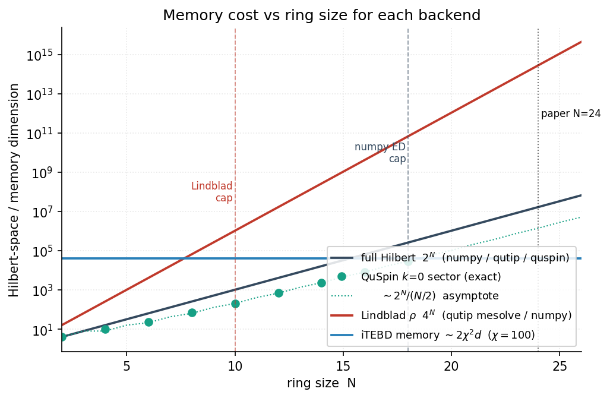
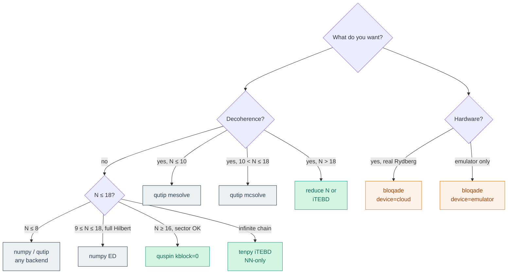

# Numerical methods

This document covers what each backend is doing under the hood:
algorithm, complexity, accuracy regime, and the test that pins its
contract. Read alongside [`architecture.md`](architecture.md) (which
covers data flow / module structure) and [`background.md`](background.md)
(which covers the physics).

## Memory cost vs ring size

Rough rule of thumb:

* **Closed-system** problems are 2^N (state vector). At N=20 that's
  16 M complex doubles ≈ 256 MB — laptop-tractable.
* **Lindblad** problems are 4^N (density matrix). At N=14 that's already
  256 M complex doubles ≈ 4 GB; N=10 is the realistic ceiling.
* **iTEBD** is N-independent: cost is set by bond dimension χ.
* **Symmetry sectors** divide the cost by the order of the symmetry
  group (~ N/2 for translation-by-2 on our model).

## Method by backend

### `numpy` — sparse Krylov ED + dense Lindblad

* **Hamiltonian.** Built as a `scipy.sparse.csr_matrix` of dimension
  `2^N × 2^N`. Single-site σˣ embeds via tensor products
  (`_kron_op_at`); diagonal n-pieces accumulate into a single
  `scipy.sparse.diags` call.
* **Closed-system evolution.** `scipy.sparse.linalg.expm_multiply` —
  Krylov-subspace approximation of `exp(-i H Δt) ψ` applied
  step-by-step along the time grid. Cost per step is roughly
  `O(m · nnz(H))` where `m` is the (adaptive) Krylov subspace size
  (typically 10-20).
* **Lindblad evolution.** Constructs the dense Liouvillian
  superoperator `L` of dimension `4^N × 4^N` (sparse internally, but
  the dense version is implied by the dimension), then
  `expm_multiply(L Δt) vec(ρ)` per timestep. Hard cap at `N=10`.
* **Hard caps.**
  * `NUMPY_ED_MAX_N = 18` (sparse 2^N states).
  * `NUMPY_LINDBLAD_MAX_N = 10` (4^N grows ×4 per qubit added).
* **Accuracy.** Krylov is essentially exact at the floating-point
  level: cross-backend tests show ~1e-14 agreement against QuSpin
  (which uses the same algorithm).
* **Pinned by.** `tests/test_invariants.py::test_energy_conservation_unitary`
  (drift < 1e-9), `tests/test_cross_backend.py` (numpy ↔ qutip ↔ quspin
  agreement to RK tolerance), `tests/test_lindblad_limit.py`.

### `qutip` — RK45 + Monte Carlo trajectories

* **Hamiltonian.** `qutip.Qobj` built with site-resolved `tensor()`
  products of σˣ, n, and pair products. Convention reconciliation in
  `_site_op` reverses QuTiP's left-to-right factor order so site 0
  remains the LSB.
* **Closed-system evolution.** `qutip.sesolve` with adaptive Runge-
  Kutta (Dormand-Prince RK45 by default).
* **Lindblad evolution.** Two paths:
  * `mesolve` — dense ρ, RK45, exact. Capped at N=10 for the same
    reason as the NumPy Lindblad path.
  * `mcsolve` — quantum-trajectory Monte Carlo. Each trajectory is
    state-vector ED with stochastic jumps; expectation values are
    averages over `n_traj` trajectories. The dispatcher auto-switches
    from `mesolve` to `mcsolve` at N > 10.
* **Hard caps.** `mesolve` ≤ N=10; `mcsolve` ≤ N=18 (state vector
  cost dominates).
* **Accuracy.** RK45 with default tolerances gives ~1e-6 absolute
  agreement against the Krylov backends. `mcsolve` adds statistical
  noise ~ `1/√n_traj`.
* **Pinned by.** `tests/test_lindblad_limit.py` (T₁, T₂* → ∞
  recovers `sesolve`), `tests/test_cross_backend.py` (numpy ↔ qutip
  agreement to 1e-5 on N=8).

### `quspin` — Krylov on full Hilbert *or* a symmetry sector

* **Hamiltonian.** Built via `quspin.operators.hamiltonian` with a
  `static_list` that expands `n_j = (1 + σ^z_j)/2`:
  * `(Ω/2) σ^x_j` per site
  * `(h_j/2) σ^z_j + Σ_{i: V_ij≠0} (V_ij/4) σ^z_i` per site
  * `(V_ij/4) σ^z_i σ^z_j` per pair
  * Constants from the n-expansion are dropped (they only shift the
    global phase).
* **Symmetry sectors.** The staggered field breaks single-site
  translation but preserves translation-by-2 (the unit cell of the
  staggered field) and bond-centred inversion. Calling
  `to_quspin(params, kblock=k)` builds the Hamiltonian directly in
  the `k`-th momentum sector via `quspin.basis.spin_basis_general`
  with the shift-by-2 permutation. The Néel false vacuum lives in
  `kblock=0`. Inversion (`pblock`) is exposed but warns about
  non-commuting symmetries — translation-by-2 and inversion-through-
  site-0 do not strictly commute on the ring, so use one or the other.
* **Closed-system evolution.** `H.evolve(psi0, t0, times)` —
  QuSpin's own Krylov-based time evolver, equivalent to scipy's
  `expm_multiply` but with sector-aware sparse matrix-vector products.
* **Sector-resolved dynamics.** Project the project-convention initial
  state through `basis.get_proj()` to get the sector basis, evolve
  there, then lift back at observable time. Verified by
  `tests/test_symmetry_sectors.py::test_sector_dynamics_match_full`
  (full vs k=0 dynamics agree to 1e-12 on N=8).
* **Hard caps.** Practical reach is N=22 with `kblock`, N=18 without.
  N=24 is the paper's target and is achievable in principle but not
  exercised by the test suite.
* **Pinned by.**
  `tests/test_symmetry_sectors.py::test_kblock_decomposition_recovers_full_spectrum`
  (sector eigenvalues union = full spectrum to 1e-10),
  `tests/test_cross_backend.py::test_numpy_quspin_agree`.

### `tenpy` — TEBD on a 2-site iMPS

* **Hamiltonian.** A `CouplingMPOModel` with custom `init_lattice`
  returning a `Lattice(Ls=[1], unit_cell=[SpinHalfSite, SpinHalfSite],
  bc_MPS="infinite")`. The 2-site unit cell makes the staggered field
  translation-invariant on the unit cell.
* **NN-only.** TEBD requires nearest-neighbour Hamiltonian on the MPS
  chain. We hard-code `R=1` in `init_terms` and emit a warning if the
  caller asked for `vdW_cutoff > 1`. Long-range support via
  `ExpMPOEvolution` (W^II MPO) was prototyped and found to be
  numerically unstable in TeNPy 1.1 for our parameters, so it's
  disabled.
* **Evolution.** `tenpy.algorithms.tebd.TEBDEngine` with order-4 Suzuki
  Trotter, `dt=0.05` per step, χ_max from the user (default 100).
* **Cost.** `O(χ³ · dt^step^count)` per step; constant in N.
* **Accuracy.** Trotter error scales as `dt^(order+1)` per step (so
  ~1e-7 per step at order 4 for `dt=0.05`); SVD truncation introduces
  a separate floor at `svd_min`.
* **Pinned by.** `tests/test_itebd_vs_ed.py::test_itebd_matches_ed_short_time_nn_only`
  (iTEBD ↔ ED N=12 NN-only agreement to 1e-6 at short times before
  the light cone reaches the ring boundary).

### `bloqade` — analog Rydberg, in-process emulator or QuEra Aquila

* **Hamiltonian.** Built with bloqade-analog's builder API. The lattice
  spacing is computed so that Aquila's natural vdW gives our V_NN:
  `a = (C₆ / V_NN)^(1/6)`. Site-resolved staggered detunings are added
  with `.rydberg.detuning.location([even]).constant(-Δ_l, …)` etc.
* **Time-series readout.** Aquila / the emulator measures at the *end*
  of a program. To produce M_AFM at multiple time points we submit one
  program per `times[k]` with `duration=times[k]`. The local emulator
  runs each in-process via `prog.bloqade.python().run(shots=…)`.
* **Initial state.** Forced to `|gg…g⟩` — Aquila cannot prepare an
  arbitrary product state. Compare against other backends with
  `psi0 = computational_basis_vector(N, 0)`.
* **Observables.** `M_AFM(t)` is computed empirically from the
  per-shot bitstrings: each shot collapses to a 0/1 string, and
  `M_AFM` is the average of `(1/N) Σ_j (-1)^j (2 b_j − 1)` across
  shots. Statistical noise floor is `≈ 1/√n_shots`.
* **Cost gate.** `device='cloud'` requires an explicit
  `i_understand_this_costs_money=True` AND a successful AWS Braket
  auth probe. Both fire before any program is built.
* **Pinned by.** `tests/test_bloqade_backend.py::test_emulator_matches_numpy_from_ground_state`
  (numpy ↔ bloqade-emulator agreement on `M_AFM(t)` from `|gg…g⟩`
  within 0.05 at `n_shots=4000` for N=4).

## Method-vs-regime decision tree

## Accuracy regime table

| Backend | Time-evolver | Accuracy on M_AFM(t) | Floor |
|---|---|---|---|
| `numpy` (closed) | Krylov | ~1e-12 to 1e-14 | machine precision |
| `numpy` (Lindblad) | Krylov on Liouvillian | ~1e-10 to 1e-12 | machine precision |
| `qutip` (`sesolve`) | RK45 | ~1e-6 | RK tolerance |
| `qutip` (`mesolve`) | RK45 on ρ | ~1e-6 | RK tolerance |
| `qutip` (`mcsolve`) | trajectories | `~1/√n_traj` | shot noise |
| `quspin` (full or sector) | Krylov | ~1e-12 to 1e-14 | machine precision |
| `tenpy` (TEBD) | order-4 Trotter + SVD | ~1e-6 (NN-only) | Trotter ⊗ SVD |
| `bloqade` (emulator) | exact Schrödinger + sampling | `~1/√n_shots` | shot noise |
| `bloqade` (cloud) | analog Rydberg + sampling | `~1/√n_shots` + SPAM | shot + hardware |

## See also

* [`architecture.md`](architecture.md) — module map and dispatcher
  contract.
* [`background.md`](background.md) — physics behind the model.
* [`tests/test_cross_backend.py`](../tests/test_cross_backend.py) — the
  regression that protects the agreement claims above.
